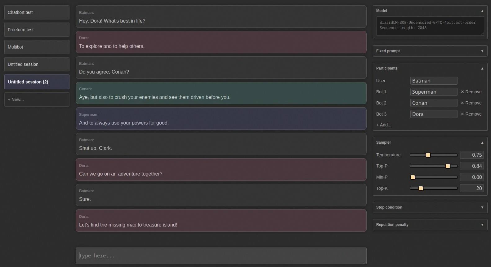

# ExLlama

A standalone Python/C++/CUDA implementation of Llama for use with 4-bit GPTQ weights, designed to be fast and
memory-efficient on modern GPUs.

Disclaimer: The project is coming along, but it's still a work in progress!

## Hardware requirements

I am developing on an RTX 4090 and an RTX 3090-Ti. 30-series and later NVIDIA GPUs should be well supported, but
anything Pascal or older with poor FP16 support isn't going to perform well. 
[AutoGPTQ](https://github.com/PanQiWei/AutoGPTQ) or [GPTQ-for-LLaMa](https://github.com/qwopqwop200/GPTQ-for-LLaMa)
are better options at the moment for older GPUs. ROCm is also theoretically supported (via HIP) though I currently 
have no AMD devices to test or optimize on.

## Dependencies

* Python 3.9 or newer
* `torch` tested on 2.0.1 and 2.1.0 (nightly) with cu118
* `safetensors` 0.3.2
* `sentencepiece`
* `ninja`

Additionally, only for the web UI:

* `flask`
* `waitress`

## Linux/WSL prerequisites

    pip install --pre torch --index-url https://download.pytorch.org/whl/nightly/cu118

## Windows prerequisites

To run on Windows (without WSL):

1. Install [MSVC 2022](https://visualstudio.microsoft.com/downloads/). You can choose to install the whole `Visual 
Studio 2022` IDE, or alternatively just the `Build Tools for Visual Studio 2022` package (make sure `Desktop
development with C++` is ticked in the installer), it doesn't really matter which.
2. Install the appropriate version of [PyTorch](https://pytorch.org/get-started/locally/), choosing one of the CUDA
versions. I am developing on the nightly build, but the stable version (2.0.1) should also work.
3. Install CUDA Toolkit, ([11.7](https://developer.nvidia.com/cuda-11-7-0-download-archive) and 
[11.8](https://developer.nvidia.com/cuda-11-8-0-download-archive) both seem to work, just make sure to match PyTorch's
Compute Platform version).
4. For best performance, enable Hardware Accelerated GPU Scheduling.

## How to

Clone repo, install dependencies, and run benchmark:

    git clone https://github.com/turboderp/exllama
    cd exllama

    pip install -r requirements.txt

    python test_benchmark_inference.py -d <path_to_model_files> -p -ppl

The CUDA extension is loaded at runtime so there's no need to install it separately. It will be compiled on the first
run and cached to `~/.cache/torch_extensions/` which could take a little while. If nothing happens at first, give it
a minute to compile.

Chatbot example:

    python example_chatbot.py -d <path_to_model_files> -un "Jeff" -p prompt_chatbort.txt

## Python module

jllllll currently maintains an installable Python module [here](https://github.com/jllllll/exllama) which may be more
suitable for integrating ExLlama with other projects

## Web UI

I also made a simple web UI for it. Don't look at the JavaScript, it was mostly written by ChatGPT and it will haunt
your dreams. But it sort of works, and it's kinda fun, especially multibot mode:



To run it:

    pip install -r requirements-web.txt

    python webui/app.py -d <path_to_model_files>

Note that sessions are stored in `~/exllama_sessions/` by default. You can change that location with `-sd` if you want.

## Docker

For security benefits and easier deployment, it is also possible to run the web UI in an isolated docker container. Note: the docker image currently only supports NVIDIA GPUs.

### Requirements

- [Docker](https://docs.docker.com/engine/install/)
- [NVIDIA Container Toolkit](https://docs.nvidia.com/datacenter/cloud-native/container-toolkit/install-guide.html)

It is recommended to run docker in [rootless mode](https://docs.docker.com/engine/security/rootless/).

### Build

The easiest way to build the docker image is using docker compose. First, set the `MODEL_PATH` and `SESSIONS_PATH` variables in the `.env` file to the actual directories on the host. Then run:

```
docker compose build
```

It is also possible to manually build the image:

```
docker build -t exllama-web .
```

NOTE: by default, the service inside the docker container is run by a non-root user. Hence, the ownership of bind-mounted directories (`/data/model` and `/data/exllama_sessions` in the default `docker-compose.yml` file) is changed to this non-root user in the container entrypoint (`entrypoint.sh`). To disable this, set `RUN_UID=0` in the `.env` file if using `docker compose`, or the following command if you manually build the image:

```
docker build -t exllama-web --build-arg RUN_UID=0 .
```

### Run

Using docker compose:

```
docker compose up
```

The web UI can now be accessed on the host at http://localhost:5000.

The configuration can be viewed in `docker-compose.yml` and changed by creating a `docker-compose.override.yml` file.

Run manually: 

```
docker run --gpus all -p 5000:5000 -v <path_to_model_dir>:/data/model/ -v <path_to_session_dir>:/data/exllama_sessions --rm -it exllama-web --host 0.0.0.0:5000
```


## Results so far

### New implementation
| Model      | Size  | grpsz | act | Seq. len.            | VRAM      | Prompt     | Best    | Worst   | Ppl  |
|------------|-------|-------|-----|----------------------|-----------|------------|---------|---------|------|
| Llama      | 7B    | 128   | no  | 2,048 t              | 5,194 MB  | 13,918 t/s | 173 t/s | 140 t/s | 6.45 |
| Llama      | 13B   | 128   | no  | 2,048 t              | 9,127 MB  | 7,507 t/s  | 102 t/s | 86 t/s  | 5.60 |
| Llama      | 33B   | 128   | no  | 2,048 t              | 20,795 MB | 2,959 t/s  | 47 t/s  | 40 t/s  | 4.60 |
| Llama      | 33B   | 128   | yes | 2,048 t              | 20,795 MB | 2,784 t/s  | 45 t/s  | 37 t/s  | 4.55 |
| Llama      | 33B   | 32    | yes | 1,550 t <sup>1</sup> | 21,486 MB | 2,636 t/s  | 41 t/s  | 37 t/s  | 4.52 |
| Koala      | 13B   | 128   | yes | 2,048 t              | 9,127 MB  | 5,529 t/s  | 93 t/s  | 79 t/s  | 6.73 |
| WizardLM   | 33B   | -     | yes | 2,048 t              | 20,199 MB | 2,313 t/s  | 47 t/s  | 40 t/s  | 5.75 |
| OpenLlama  | 3B    | 128   | yes | 2,048 t              | 3,128 MB  | 16,419 t/s | 226 t/s | 170 t/s | 7.81 |
 
<sup>1</sup> Can not achieve full sequence length without OoM  

All tests done on stock RTX 4090 / 12900K, running with a desktop environment, with a few other apps also using VRAM.

**"Prompt"** speed is inference over the sequence length listed minus 128 tokens. **"Worst"** is the average speed for
the last 128 tokens of the full context (worst case) and **"Best"** lists the speed for the first 128 tokens in an
empty sequence (best case.)

VRAM usage is as reported by PyTorch and does not include PyTorch's own overhead (CUDA kernels,
internal buffers etc.) This is somewhat unpredictable anyway. Best bet is to just optimize VRAM usage by the model,
probably aiming for 20 GB on a 24 GB GPU to ensure there is room for a desktop environment and all of Torch's
internals.

Perplexity is measured only to verify that the models are working. The dataset used is a particular, small sample from
WikiText, so scores are not comparable to other Llama benchmarks and only useful for comparing the different Llama
models to one another.

### Dual GPU results

The following benchmarks are from a 4090 + 3090-Ti with `-gs 17.2,24`:

| Model   | Size | groupsize | act | Seq. len.      | VRAM      | Prompt    | Best   | Worst   | Ppl   |
|---------|------|-----------|-----|----------------|-----------|-----------|--------|---------|-------|
| Llama   | 65B  | 128       | yes | 2,048 t        | 39,804 MB | 1,109 t/s | 20 t/s | 18 t/s  | 4.20  |
| Llama   | 65B  | 32        | yes | 2,048 t        | 43,424 MB | 1,037 t/s | 17 t/s | 16 t/s  | 4.11  |
| Llama-2 | 70B  | 128       | yes | 2,048 t        | 40,680 MB | 914 t/s   | 17 t/s | 14 t/s  | 4.15  |
| Llama-2 | 70B  | 32        | yes | 2,048 t        | 36,815 MB | 874 t/s   | 15 t/s | 12 t/s  | 4.10  |

Note that perplexity scores may not be strictly apples-to-apples between Llama and Llama 2 due to their different
pretraining datasets.

## Todo

Moved the todo list [here](doc/TODO.md).  

## Compatibility

[Here](doc/model_compatibility.md) is a list of models confirmed to be working right now.

## Recent updates

**2023-01-09**: Added rope_theta parameter for (at least partial) CodeLlama support. If you were using alpha = 97
or similar, you would no longer need that for CodeLlama models. Still stuff to sort out regarding the extended
vocabulary.

**2023-08-09**: Added support for sharded models. `config.model_path` now accepts either a filename or a list of
filenames. `model_init()` will detect multiple .safetensors files if given a model directory. Note the change in the
various examples: `model_path = glob.glob(st_pattern)[0]` becomes simply `model_path = glob.glob(st_pattern)`. Also
there's a little script in `util/shard.py` to split large .safetensors files. It also produces an index.json file for
the sharded model, just for completeness, although ExLlama doesn't need it to read the shards. Note that the 
**safetensors dependency was bumped to version 0.3.2**. 

**2023-08-12**: Preliminary, initial and tentative release of [ExLlamaV2](https://github.com/turboderp/exllamav2).
It doesn't do all the things that ExLlamaV1 does, yet, but it's better at what it does do. So check it out!